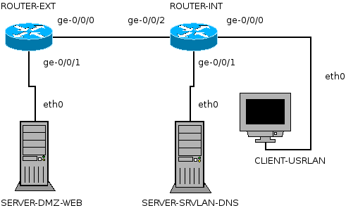
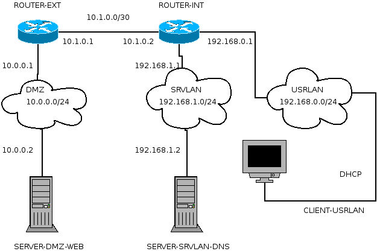

# 1. Introduction

Our design is two routers an internal and external one, three subnets DMZ, SRVLAN and
URSLAN. We set up two servers a web server running debian, a dns server, and a client
running Ubuntu. The goal of this is to have a functional network where we can access our
servers from our virtual desktop.

# 2. Overview

### Level 2 Diagram

### Level 3 Diagram

# 3. Performance

We are doing everything very lowkey and simple therefore there will be somewhat of a latency between
the desktop and the servers. Everything is running thru virtual machines in VMWARE, and therefore we
assign each device its own amount of both gb and rams no device reaching over 2 gb and over 512 gb ram

# 4. Hardware

There is no hardware because everything is running virtually.

# 5. Protocols and Standards

we are using these protocols DNS, HTTP, TCP, IP. With DNS being the most unknown of the
4, DNS (Domain Name System) which we are using on one of our servers. DNS basically
translates a name to an IP address if for example I want to access www.google.com I type in
the name www.google.com I could also have typed in its IP address 208.80.152.2 so what the
DNS does I that when I enter www.google.com it translates it to the correct IP address
208.80.152.2 and sends you to the website.

# 6. IP Layout

| Network name |   Gateway   |        Subnet         |        Connections             |
|--------------|-------------|-----------------------|--------------------------------|
|  ROUTER-EXT  | 10.0.0.1    | DMZ 10.0.0.0/24       | SERVER-DMZ-WEB 10.0.0.2        | 
|  ROUTER-INT  | 192.168.1.1 | SRVLAN 192.168.1.0/24 | SERVER-SRVLAN-DNS 192.168.1.2  | 
|  ROUTER-INT  | 192.168.0.1 | SRVLAN 192.168.0.0/24 | CLIENT-USRLAN 192.168.0.2      |
|  ROUTER-EXT  | 10.1.0.1    | 10.0.0.0/30           | ROUTER-INT 10.1.0.2            |

# 7. Naming Convention

Naming convention is used by first defining the device type then what network it is on and last
what service it uses.
ROUTER-EXT, ROUTER-INT, SERVER-DMZ-WEB, SERVER-SRVLAN-DNS, CLIENT-
URSLAN

# 8. Directory Layout

 * `images`: Images for the documentation
 * `recovery`: The recovery documentation
 * `router-*`: Configuration files for the routers
 * `server-*`: Configuration files for the servers
 
# 9. Futher reading

 * [SRX Configuration example using fully qualified domain names in security policies](https://kb.juniper.net/InfoCenter/index?page=content&id=KB20994&actp=search)
 * [Example: Configuring Security Zones and Policies for SRX Series](https://www.juniper.net/documentation/en_US/junos12.1x46/topics/example/security-srx-device-zone-and-policy-configuring.html)
 * [Juniper SRX Port Forwarding / Destination NAT](https://doittherightway.wordpress.com/2013/03/07/juniper-srx-port-forwarding-destination-nat/) 
 * [SRX Getting Started - Configure DNS](https://kb.juniper.net/InfoCenter/index?page=content&id=KB15656&actp=search)
 * [Understanding NAT Rule Sets and Rules](http://www.juniper.net/documentation/en_US/junos12.1x47/topics/concept/nat-security-rule-set-and-rule-understanding.html)
 
 
