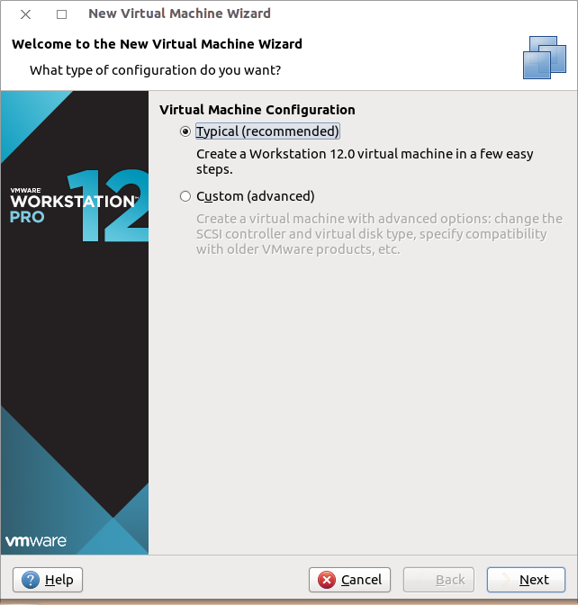
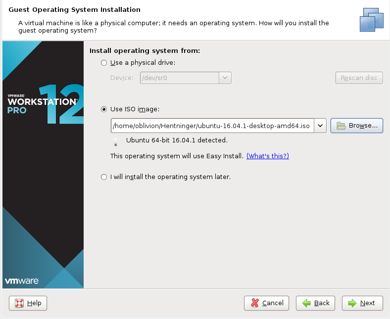
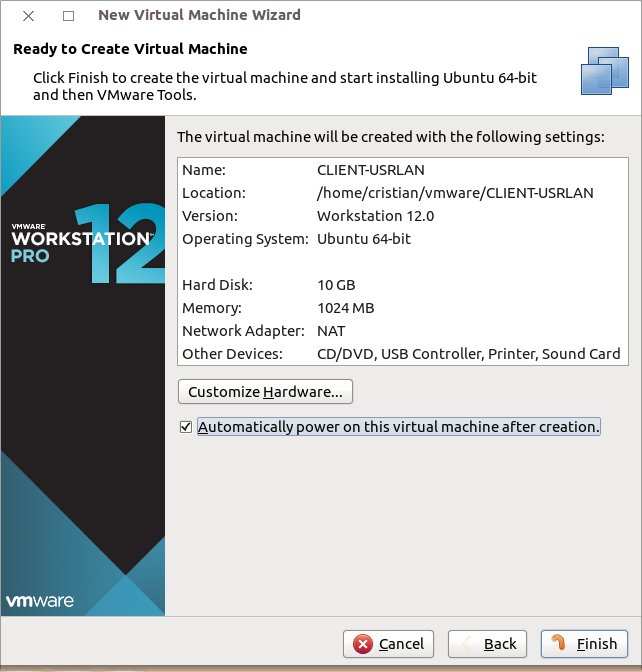
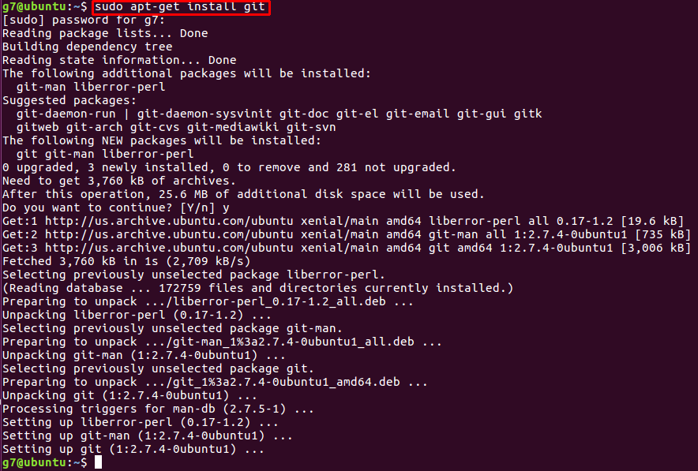
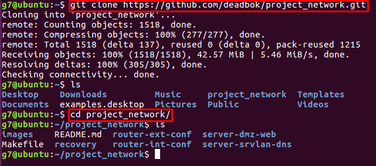
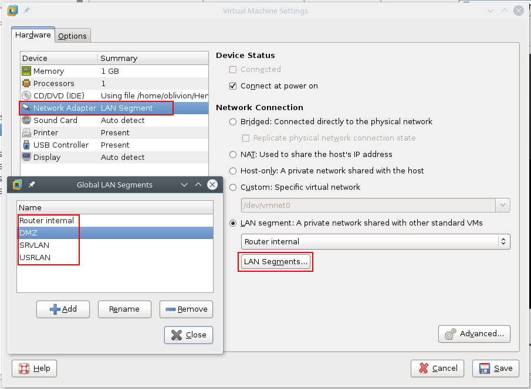

# Recovery Documentation
## Project network
**Version 0.9.2**

# 1 Introduction

This document describes the steps needed to create project network.
*It is assumed that you have a Windows 7/8/10 or a desktop Linux
distribution installed on the host machine as well as VMWare Workstation
12 Pro.*

The latest version of this document is available at:
[https://github.com/deadbok/project_network](https://github.com/deadbok/project_network)

Project web page:
[https://deadbok.github.io/project_network/](https://deadbok.github.io/project_network/)

# 2 Overview

This are the overall steps in recreating the system from scratch.
- Software sources
- Create virtual machines and install OSs if needed
- Define the interfaces on each machine and link them together
- Configure internal router
- Configure internal server for DHCP
- Configure the external router
- Configure the external server for HTTP services
- Configure internal machine for local DNS resolution

# 3 System Requirements

Based on the current status in recovery and testing stages, the following
hardware and software are a minimum requirement in order to run the
network. All mentioned software resources are pointing to official
manufacturer download locations and official Lillebaelt Academy
curriculum resources.

### 3.1 Hardware

- CPU: Dual-Core Processor with multi-threading and virtualisation.
- Memory: 8GB DDR3 Dual-Channel.
- Storage: 20GB HDD Free Space.

### 3.2 Software

**License Limited Software**
- Machine Virtualisation: [MWare Workstation 12 Pro](http://www.vmware.com/products/workstation/workstation-evaluation.html)

**Lillebaelt Academy Curriculum Resources**
- Network Routers: [JunOS SRX VMWare Virtual Machine OVF](https://fronter.com/eal/links/files.phtml/2080432588$548107012$/1st+Semester/Data+Communication/Software/junos-vsrx-12.1X47-D15.4-domestic.ovf)
- Network Routers: [JunOS SRX VMWare Virtual Machine VMDK](https://fronter.com/eal/links/files.phtml/2080432588$548107012$/1st+Semester/Data+Communication/Software/junos-vsrx-12.1X47-D15.4-domestic-disk1.vmdk)

**Open Source Software**
- Network Servers: [Ubuntu 16.04LTS Server Installer ISO](https://www.ubuntu.com/download/server/thank-you?version=16.04.1&architecture=amd64)
- Network Client: [Ubuntu 16.04LTS Desktop Installer ISO](https://www.ubuntu.com/download/desktop/contribute?version=16.04.1&architecture=amd64)

# 4 Creating The Virtual Machines And Install Their OSs

When creating the virtual machines do not bother with the network
configuration at this time.

## 4.1 CLIENT-USRLAN (Ubuntu 16.04LTS Desktop Client)

For the Ubuntu Desktop, but also for the Server versions use the VMWare 
VM Typical settings, since it sets everything needed by default, even
the network interface to NAT, which is an essential feature needed in
the OS install and later software/service installation.
When setting up this machine in VMWare,
create a Typical custom machine (as shown in [Illustration 1](#illustration1)).

<a name="illustration1">

</a>
> Illustration 1: Creating a Typical custom virtual machine

Next select the downloaded Ubunto Desktop ISO as the operating system
source (as shown in [Illustration 2](#illustration2)).

<a name="illustration2">

</a>
> Illustration 2: Selecting operating system source

Setup will request adding a name for the machine, disk size, user and
password. By filling in the user information a less privileged user will
be created. When logged in as this user you can temporarily change to
the `root` account, which is the superuser of the system that has access
to all of the OS and hardware. Machine settings should resemble those in
[Illustration 3](#illustration3).

<a name="illustration3">

</a>
> Illustration 3: VM Settings - CLIENT-USRLAN


## 4.2 SERVER-SRVLAN-DNS & SERVER-DMZ-WEB (Ubuntu 16.04LTS Server)

The Ubuntu Server Virtual Machines will follow the same steps as those 
of creating the  [**CLIENT-USRLAN**](#illustration1), except using the
downloaded Ubuntu Server ISO as the operating system source
(as shown in [Illustration 5](#illustration5)).

<a name="illustration2">

</a>
> Illustration 5: Selecting operating system source

Settings for each server should resemble one of [Illustration 6](#illustration6)
or [Illustration 7](#illustration7).

<a name="illustration6">

</a>
> Illustration 6: VM Settings - SERVER-SRVLAN-DNS

<a name="illustration7">

</a>
> Illustration 7: VM Settings - SERVER-DMZ-WEB

## 4.3 ROUTER-EXT & ROUTER-INT (JunOS vSRX 12.1)

The downloaded files has a VMWare “.ovf” file that you can open from the VMWare file menu.
Rename the machine “ROUTER-EXT”. Create a full clone of the “ROUTER-EXT” machine and name
that one “ROUTER-INT”. The JunOS operating system is already installed on the image,
therefore there are no OS installation steps for these machines.

# 5 Configuring the virtual machines

The USRLAN-CLIENT client is connected to the internet to clone this
repository, the configurations files needed for the servers and routers
are then copied from USRLAN-CLIENT to the individual machines.

# 5.1 Cloning the git repository to USRLAN-CLIENT

First install git to USRLAN-CLIENT as shown in [Illustration 8](#illustration8).

<a name="illustration8">

</a>
> Illustration 8: Installing git on USRLAN-CLIENT

then clone this repository onto the USRLAN-CLIENT as shown in
[Illustration 9](#illustration9).

<a name="illustration9">

</a>
> Illustration 9: Installing git on USRLAN-CLIENT

## 5.2 Configuring the routers for SSH

The goal of these steps are to get the routers online on the NAT network
temporarily to copy the configuration files from the git repositry now
present on USRLAN-CLIENT.


```bash
#Enter the cli
cli

#Enter edit mode
edit

# Set the root password
set system root-authentication plain-text-password
New Password: type password here
Retype new password: retype password here

# Set the interface to DHCP
set interfaces ge-0/0/3 unit 0 family inet dhcp

# Delete the interface from the untrusted zone.
delete security zones security-zone untrust interfaces ge-0/0/3.0

# Put the interface in the trusted zone and allow all services
set security zones security-zone trust interfaces ge-0/0/3.0 host-inbound-traffic system-services all

# Allow all protocols
set security zones security-zone trust interfaces ge-0/0/3.0 host-inbound-traffic protocols  all

# Commit the changes
commit
```
## 5.3 CLIENT-USRLAN (Ubuntu Desktop Client)

The client boots of the ISO image and does not need any configuration.

## 5.4 ROUTER-INT
To copy the configuration file onto the router when configured for SSH
access do like this:

```bash
scp router-int.conf root@172.16.189.133:~/.
```
Then on the router login and load the configuration:

```bash
# Enter the cli
cli

# Enter edit mode
edit

# Load the configuration that has just been copied to the
# router.
load override router-int.conf

# Commit the new configuration
commit
```
**When the configuration has been loaded the password will be `test12`**

## 5.5 ROUTER-EXT
To copy the configuration file onto the router when configured for SSH
access do like this:

```bash
scp router-ext.conf root@172.16.189.133:~/.
```

Then on the router login and load the configuration:

```bash
# Enter the cli
cli

# Enter edit mode
edit

# Load the configuration that has just been copied to the
# router.
load override router-ext.conf

# Commit the new configuration
commit
```
**When the configuration has been loaded the password will be `test12`**

## 5.6 SERVER-SRVLAN-DNS

* Copy the configuration files into the server
* Install dnsmasq
* Enable the dnsmasq service

Install dnsmasq on the virtual machine:

```bash
# Install dnsmasq
apt-get install dnsmasq

# Enable dnsmasq at boot
update-rc.d dnsmasq enable

# Start the service now
service dnsmasq start
```

Copy the configuration files from the host to the virtual machine:

```bash
scp -r server-srvlan-dns/* root@192.168.206.132:/.
```

## 5.7 SERVER-DMZ-WEB

 * Install Nginx
 * Enable the Nginx service

Install dnsmasq on the virtual machine:

```bash
# Install dnsmasq
apt-get install nginx

# Enable dnsmasq at boot
update-rc.d nginx enable

# Start the service now
service nginx start
```

Copy the default HTML page to the server.

```bash
scp -r server-dmz-web/* root@192.168.206.130:/.
```

## 5.8 Network setup

This configuration uses the WMWare LAN segment feature. The LAN segments
created in the first virtual machine area available to the rest as well.

Open the settings for the virtual machine and navigate to the LAN
segment settings as shown in [Illustration 4](#illustration4).

<a name="illustration4">

</a>
> Illustration 4: Creating the LAN segments

Set the interfaces of the virtual machines according to [Table 1](#table1):

<span name="table1">&nbsp;<span>

|    Machine name   |   Interface 1   | Interface 2 |   Interface 3   |  Interface 4  |
|-------------------|:---------------:|:-----------:|:---------------:|:-------------:|
| CLIENT-USRLAN     | USRLAN          |     *nc*    |      *nc*       |      *nc*     |
| ROUTER-INT        | USRLAN          |    SRVLAN   | Router internal |      *nc*     |
| ROUTER-EXT        | Router internal |     DMZ     |      *nc*       |      *nc*     |
| SERVER-SRVLAN-DNS | SRVLAN          |     *nc*    |      *nc*       |      *nc*     |
| SERVER-DMZ-WEB    | DMZ             |     *nc*    |      *nc*       |      *nc*     |

*nc*: not connected.

> Table 1: Virtual machine interface connections.
