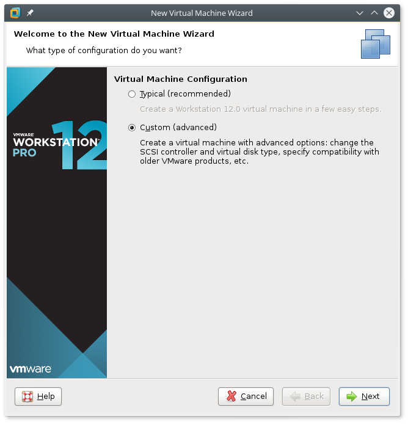
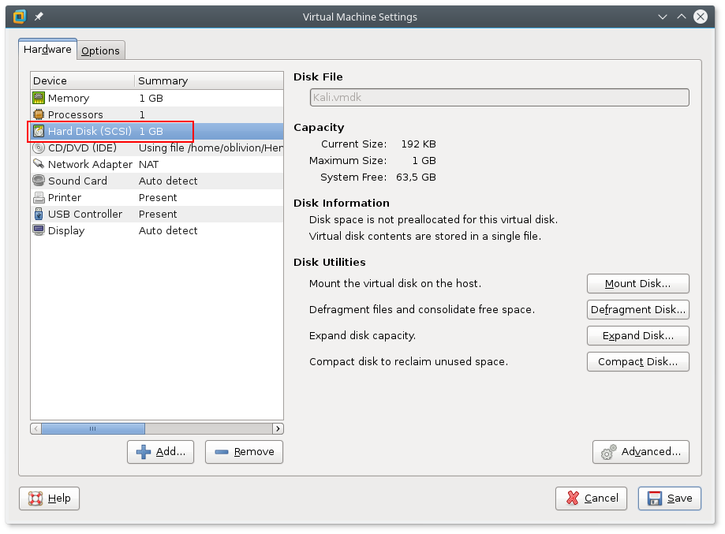

# Recovery Documentation
## Project network
**Version 0.9.1**

# 1 Introduction

This document describes the steps needed to create project network.

The latest version of this document is available at [https://github.com/deadbok/project_network](https://github.com/deadbok/project_network)

Project web page [https://deadbok.github.io/project_network/](https://deadbok.github.io/project_network/)

*When nothing else is mentioned commands are executed as root*

**This is a test/teaching setup, there are some configuration details in here that should NEVER be allowed in a production environment.**
- **Root logins from remote machines, instead create an unprivileged user for remote access.**
- **Leaving unused interface configurations in the routers, they could be exploided and should be removed.**


# 2 Overview

This are the overall steps in recreating the system from scratch.
- Software sources
- Create virtual machines and install OSs if needed
- Define the interfaces on each machine and link them together
- Configure internal router
- Configure internal server for DHCP
- Configure the external router
- Configure the external server for HTTP services
- Configure internal machine for local DNS resolution

# 3 Software sources:

These are the links to the external resources that has been downloaded to get things working:

- [MWare Workstation 12 Pro](http://www.vmware.com/products/workstation/workstation-evaluation.html)
- [JunOS SRX VMWare virtual machine OVF](https://fronter.com/eal/links/files.phtml/2080432588$548107012$/1st+Semester/Data+Communication/Software/junos-vsrx-12.1X47-D15.4-domestic.ovf)
- [JunOS SRX VMWare virtual machine VMDK](https://fronter.com/eal/links/files.phtml/2080432588$548107012$/1st+Semester/Data+Communication/Software/junos-vsrx-12.1X47-D15.4-domestic-disk1.vmdk)
- [Debian net installer ISO](http://cdimage.debian.org/debian-cd/8.6.0/amd64/iso-cd/debian-8.6.0-amd64-netinst.iso)
- [Kali Linix 64-bit ISO](http://cdimage.kali.org/kali-2016.2/kali-linux-2016.2-amd64.iso)

# 4 Creating the Virtual Machines and install their OSs

When creating the virtual machines do not bother with the network configuration at this time.

## 4.1 CLIENT-USRLAN (Kali client)

The Kali client is a Live CD and is run directly from the ISO image, with no persistent storage. When setting up this machine in VMWare, create a custom machine (as shown in [Illustration 1](#illustration1)) with no emulated hard drive.

<a name="illustration1">

</a>
> Illustration 1: Creating a custom virtual machine

Add the ISO image to the virtual machine in the screen after that, and on the next screen select the OS as shown in [Illustration 2](#illustration2).

<a name="illustration2">

</a>
> Illustration 2: OS selection for the Kali Client

On the following screen enter the name CLIENT-USRLAN. Set the amount of memory to no less than 1024MB or Kali will complain. VMWare insísts on creating a virtual hard drive, but since Kali is running from a live image, you are free to delete this virtual drive when the machine is created (see [Illustration 3](#illustration3))

<a name="illustration3">

<a name="illustration3">
> Illustration 3: You can delete the Hard Disk image since Kali is booted from the ISO image.

## 4.2 SERVER-SRVLAN-DNS & SERVER-DMZ-WEB (Debian netinst)

To create the virtual machines for the Debian server, just click through the guided VM creation, in VMWare. There are only three changes, remember to select the debian-8.6.0-amd64-netinst.iso, for the installation media, set the correct machine name, and decrease the virtual hard drive to 2GB, to not waste space.
When installing the Debian GNU/Linux remember to have a working Internet connection in the VM, because the netinst image fetches most of the Debian packages from the Internet. When the Debian installation asks for the hostname, use the name from the naming convention. Set the domain to “localnet”.

## 4.3 ROUTER-EXT & ROUTER-INT (JunOS SRX VM)

The downloaded files has a VMWare “.ovf” file that you can open from the VMWare file menu. Rename the machine “ROUTER-EXT”. Create a full clone of the “ROUTER-EXT” machine and name that one “ROUTER-INT”. The JunOS operating system is all ready installed on the image, so for these machines there are no OS installation step.

# 5 Configuring the virtual machines

## 5.1 General setup of the Debian servers

To login to the server to install the configuration files an SSH connection to the virtual machine has to be established. To do this follow these steps:

### 5.1.1 Setup SSH for root logins over the network

Login as root and edit `/etc/ssh/sshd_config`, find the following line:
```bash
PermitRootLogin without-password
```
and change it to:
```bash
PermitRootLogin yes
```
Save the file and then restart SSH service:
```bash
service ssh restart
```

### 5.1.2 Add another network card to the virtual machine

Open the properties for the virtual machine, and add another network
card with a NAT connection.

> Adding a network card using Host-only to allow connecting from the host.

After these steps simply get an address for the new interface on the 
server vm. There is no need to make any more changes to configuration
files since this is a temporary management connection.
To get an IP address for eth1 (assuming this is the name of the new
network device) in the server vm run the following as root:
```bash
dhclient eth1
```
When the command finishes run ip addr, to learn the address assigned by DHCP:
```bash
ip addr
```
The output looks like this:


To ssh from the host to the vm server use the following command (with the actual IP address of the server):
```bash
ssh root@172.16.189.128
```


## 5.2 General SSH setup of the routers
As with the server, and ssh connection is needed to copy the configuration to the routers. To have a Host-only connection refer to section “Add another network card to the virtual machine“.

### 5.2.1 Configuring the router for SSH
To set up the router for SSH access the following configuration has to be set for the Host-only interface:
```bash
#Enter the cli
cli

#Enter edit mode
edit

# Set the root password
set system root-authentication plain-text-password 
New Password: type password here
Retype new password: retype password here

# Set the interface to DHCP
set interfaces ge-0/0/3 unit 0 family inet dhcp

# Delete the interface from the untrusted zone.
delete security zones security-zone untrust interfaces \
ge-0/0/3.0

# Put the interface in the trusted zone and allow all services
set security zones security-zone trust interfaces \
ge-0/0/3.0 host-inbound-traffic system-services all

# Allow all protocols
set security zones security-zone trust  \
interfaces ge-0/0/3.0 host-inbound-traffic protocols  all

# Commit the changes
commit
```
## 5.3 CLIENT-USRLAN (Kali client)

The client boots of the ISO image and does not need any configuration.

## 5.4 ROUTER-INT
To copy the configuration file onto the router when configured for SSH
access do like this:

```bash
scp router-int.conf root@172.16.189.133:~/.
```
Then on the router login and load the configuration:

```bash
# Enter the cli
cli

# Enter edit mode
edit

# Load the configuration that has just been copied to the 
# router.
load override router-int.conf

# Commit the new configuration
commit
```

## 5.5 ROUTER-EXT
To copy the configuration file onto the router when configured for SSH
access do like this:

```bash
scp router-ext.conf root@172.16.189.133:~/.
```

Then on the router login and load the configuration:

```bash
# Enter the cli
cli

# Enter edit mode
edit

# Load the configuration that has just been copied to the 
# router.
load override router-ext.conf

# Commit the new configuration
commit
```

## 5.6 SERVER-SRVLAN-DNS

 * Copy the configuration files into the server
 * Install dnsmasq
 * Enable the dnsmasq service

Install dnsmasq on the virtual machine:

```bash
# Install dnsmasq
apt-get install dnsmasq

# Enable dnsmasq at boot
update-rc.d dnsmasq enable

# Start the service now
service dnsmasq start
```

Copy the configuration files from the host to the virtual machine:

```bash
scp -r server-srvlan-dns/* root@192.168.206.132:/.
```

## 5.7 SERVER-DMZ-WEB

 * Install apache
 * Enable the apache service
 
Install dnsmasq on the virtual machine:

```bash
# Install dnsmasq
apt-get install apache2

# Enable dnsmasq at boot
update-rc.d apache2 enable

# Start the service now
service apache2 start
```

Copy the default HTML page to the server.

```bash
scp -r server-dmz-web/* root@192.168.206.130:/.
```

## 5.8 Network setup

This configuration uses the WMWare LAN segment feature. The LAN segments
created in the first virtual machine area available to the rest as well.

Open the settings for the virtual machine and navigate to the LAN
segment settings as shown in [Illustration 4](#illustration4).

<a name="illustration4">

</a>
> Illustration 4: Creating the LAN segments

Set the interfaces of the virtual machines according to [Table 1](#table1):

<span name="table1">&nbsp;<span>

|    Machine name   |   Interface 1   | Interface 2 |   Interface 3   |  Interface 4  |
|-------------------|:---------------:|:-----------:|:---------------:|:-------------:|
| CLIENT-USRLAN     | USRLAN          |     *nc*    |      *nc*       |      *nc*     | 
| ROUTER-INT        | USRLAN          |    SRVLAN   | Router internal |      *nc*     | 
| ROUTER-EXT        | Router internal |     DMZ     |      *nc*       |      *nc*     |
| SERVER-SRVLAN-DNS | SRVLAN          |     *nc*    |      *nc*       |      *nc*     |
| SERVER-DMZ-WEB    | DMZ             |     *nc*    |      *nc*       |      *nc*     |

*nc*: not connected.

> Table 1: Virtual machine interface connections.
